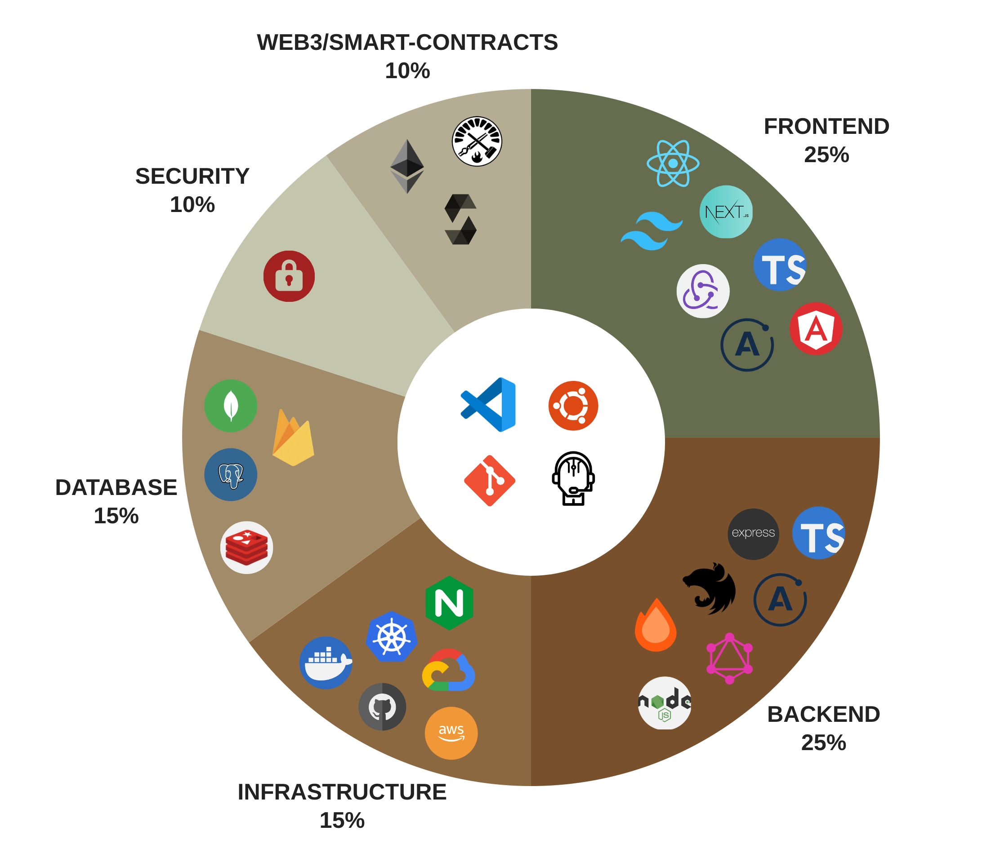

  <pre>
  {
    fullname: 'Saad Abbasi',
    oneliner: '7+y Sr. Full Stack Engineer (Web 2.0 & 3.0) | Solutions Architect (AWS) | Softwartist',
    experience: '7+ years',
    skills: {
      frontend: ['TypeScript', 'React', 'Angular', 'Nextjs', 'Redux', 'Apollo-GraphQL', 'Tailwind', 'HTML/CSS'],
      backend: ['TypeScript', 'Apollo-GraphQL', 'Nodejs', 'Express', 'Fastify', 'Hono', 'Nestjs', 'Bun'],
      infrastructure: ['Amazon Web Services', 'Google Cloud Services', 'Docker', 'Kubernetes', 'GitHub Actions', 'NGINX'],
      database: ['PostgreSQL (SQL, ACID)', 'MongoDB (NoSQL, EC)', 'Redis (NoSQL, Memory/EC)', 'Firebase (RealTime)'],
      Security: ['JWT', 'TLS', 'CSPs', 'Network ACL', 'SecurityGroups', 'Secure Programming'],
      blockchain: ['ethereum', 'solidity', 'foundry', 'hardhat', 'geth', 'anvil'],
    }
  }
  </pre>

  
</img>
