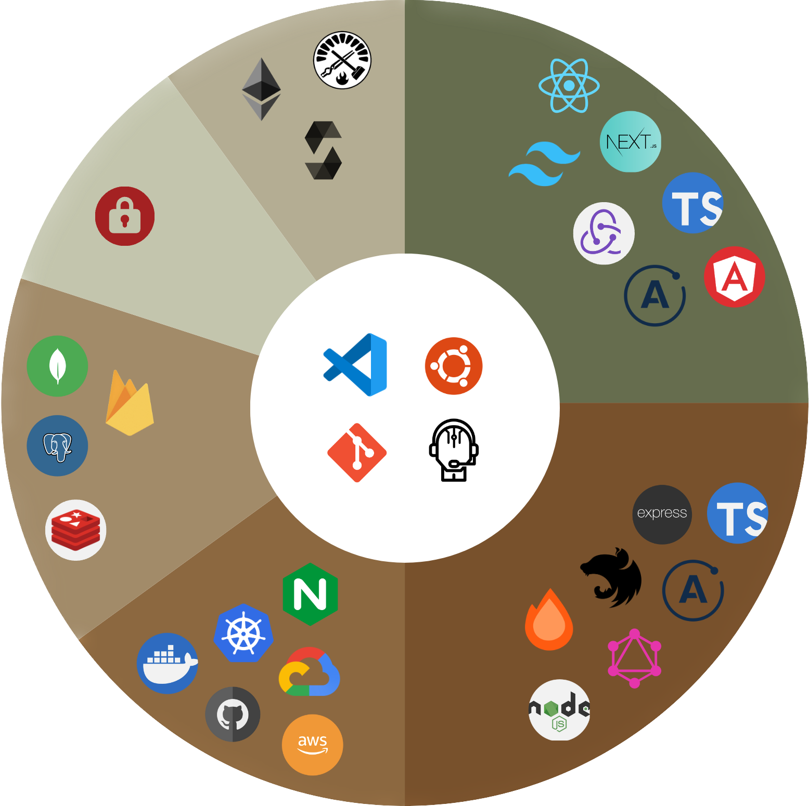

### "Saad Abbasi" WHO? 🤔💭

</img>

Over 7 years of experience of working in domains like backend, frontend, infrastructure, and blockchain with different local and international teams and delivering secure, scalable, and innovative solutions. 

---

<b>Languages: </b>
 - TypeScript/JavaScript: 7+ years of experience
 - Solidity: 2+ year of experience
 - Golang/Rust: >1 year of experience

<b>Web3 with Ethereum (2+ years of experience):</b>
- Skilled in Solidity, Foundry, Hardhat, and Ganache.
- Experience with smart contract development and testing.
- Knowledge of blockchain ecosystem, how decentralised applications applications works. 

<b>Backend Technologies: (4+ years)</b>
- Proficient in Node.js, Hono, Redis, Nestjs, Fastify, PostgreSQL, TypeORM, Apollo GraphQL, Serverless.
- Experienced in building secure, performant and scalable backend applications.
- Experienced in handling monorepos, microservices, distributed monoliths and monolith applications. 

<b>Infrastructure: (2+ years)</b>
- Proficient in Amazon Web Services (AWS), Google Cloud Platform (GCP), NGINX, Docker Swarm, and Pulumi.
- Experience in deploying and managing applications on cloud platforms.
- Knowledge of infrastructure-as-code practices and automation using Pulumi.
- Able to build and scale containerised services and microservices using Docker.
- Skilled in automating workflows using GitHub Actions.

<b>Frontend Technologies: (4+ years)</b>
- Grip on React.js, Next.js and Angular with TypeScript, and Sass.
- Comfortable with any UIKit Bootstrap, Material Design, SemanticUI, Tailwind or ShadCN.
- Follows best practices of application level state, data layer, design system, performance and content delivery.
- Ability to develop intuitive and visually appealing user interfaces with minimal bundle size and performance overhead.

